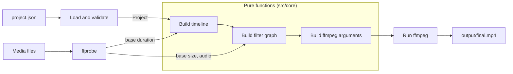

# ffmpeg-timeline

A Node.js CLI that reads a JSON description of a video timeline and compiles it into a single
FFmpeg `filter_complex` invocation that renders the final MP4.

A timeline consists of:

- a **base track**: the main video, which can be frozen on a frame for a while and then resumed;
- any number of **overlay tracks**: picture-in-picture videos whose size, position, opacity and
  visibility change at given times, including going fullscreen and back.

The tool has no runtime dependencies besides Node.js and an FFmpeg installation.

## Why compile a timeline to one filter graph

The obvious way to build this kind of edit is step by step: cut the base into pieces, render a
freeze clip, render each overlay state to an intermediate file, concatenate everything. Every step
re-encodes, so quality degrades with each generation, the intermediate files have to be managed,
and cuts made by separate encodes drift from each other by a frame here and there.

Expressing the whole edit as one filter graph avoids that:

- every source is decoded once and the result is encoded once, so there is no generation loss;
- there are no intermediate files to create, name or clean up;
- all timing lives in one place, on one clock, so pieces cannot drift apart;
- the edit becomes data. The graph is the output of a pure function of the project file and a few
  facts about the media, which makes it reviewable, diffable and testable without running FFmpeg.

The last point shapes the code: everything up to the FFmpeg process is plain data transformation.

## Pipeline



| Stage                  | Module                     | Input -> output                                 | Side effects   |
| ---------------------- | -------------------------- | ----------------------------------------------- | -------------- |
| Load project           | `src/io/project-loader.ts` | file path -> `Project` and absolute input paths | reads files    |
| Validate               | `src/core/validation.ts`   | unknown JSON -> `Project` or `ValidationError`  | none           |
| Probe                  | `src/io/probe.ts`          | media file -> size, duration, frame rate, audio | runs `ffprobe` |
| Build timeline         | `src/core/timeline.ts`     | `Project` -> freezes and overlay segments       | none           |
| Build filter graph     | `src/core/filter-graph.ts` | timeline -> `filter_complex` string             | none           |
| Build ffmpeg arguments | `src/core/ffmpeg-args.ts`  | graph, inputs, output -> argument list          | none           |
| Run                    | `src/io/ffmpeg.ts`         | argument list -> rendered file                  | runs `ffmpeg`  |

`src/render.ts` wires the stages together and `src/cli.ts` is the command-line entry point.

## Requirements

- Node.js 20 or newer
- `ffmpeg` and `ffprobe` on the `PATH` (developed against FFmpeg 8.1)

## Quick start

```sh
npm install
npm run build
npm run sample
node dist/cli.js render project.json
```

`npm run sample` generates two synthetic 12-second clips with FFmpeg's built-in test sources
(`input/base.mp4`, 1080x1920 with a tone, and `input/overlay.mp4`, 720x1280), so the repository
does not need to ship any video. The render command prints the timeline and the generated filter
graph, runs FFmpeg and writes `output/final.mp4`.

```
Usage: ffmpeg-timeline render [project.json] [options]

Arguments:
  project.json         Project file (default: project.json)

Options:
  -o, --output <file>  Output file (default: output/final.mp4 next to the project file)
  -h, --help           Show this help
  -v, --version        Show the version
```

The package declares a `bin` entry, so after `npm link` the same command is available as
`ffmpeg-timeline render project.json`.

The pure part of the pipeline can also be used as a library:

```ts
import { compileProject, validateProject } from 'ffmpeg-timeline';

const project = validateProject(JSON.parse(json));
const { graph } = compileProject(project, {
  width: 1080,
  height: 1920,
  duration: 12,
  hasAudio: true,
});
console.log(graph.filterComplex);
```

## Project file format

The example project in this repository (`project.json`):

```json
{
  "tracks": [
    {
      "type": "video",
      "source": "input/base.mp4",
      "transform": [
        { "time": 5, "freeze": true },
        { "time": 8, "freeze": false }
      ]
    },
    {
      "type": "video",
      "source": "input/overlay.mp4",
      "transform": [
        { "time": 0, "scale": 0.3, "anchor": "bottom-right", "padding": 30 },
        { "time": 5, "fullscreen": true },
        { "time": 8, "scale": 0.3, "anchor": "top-left", "padding": 30 },
        { "time": 12, "visible": false }
      ]
    }
  ]
}
```

It plays the base with the overlay in the bottom-right corner, freezes the base at 5 s while the
overlay goes fullscreen for three seconds, resumes the base with the overlay in the top-left
corner, and hides the overlay at 12 s. The base is 12 s long and is held for 3 s, so the result
is 15 s long.

### The clock

Every `time` in the file, on every track, is in seconds on the **output timeline**: the clock of
the rendered video. If the base is frozen from 5 s to 8 s, an overlay keyframe at `"time": 8`
takes effect exactly when the base resumes.

### Top level

| Field    | Type  | Required | Description                                                                 |
| -------- | ----- | -------- | --------------------------------------------------------------------------- |
| `tracks` | array | yes      | At least one track. `tracks[0]` is the base, all others are overlay tracks. |

Overlay tracks are drawn in order, so a later track is on top of an earlier one. A project with
only a base track is valid.

### Track

| Field       | Type   | Required            | Description                                           |
| ----------- | ------ | ------------------- | ----------------------------------------------------- |
| `type`      | string | yes                 | Must be `"video"`.                                    |
| `source`    | string | yes                 | Path to the media file, relative to the project file. |
| `transform` | array  | overlay tracks only | Keyframes, in strictly increasing `time` order.       |

### Base track keyframes

| Field    | Type    | Required | Description                                                       |
| -------- | ------- | -------- | ----------------------------------------------------------------- |
| `time`   | number  | yes      | Seconds on the output timeline, `>= 0`.                           |
| `freeze` | boolean | yes      | `true` holds the frame currently shown, `false` resumes playback. |

Keyframes must alternate, starting with `freeze: true`, and every freeze must be released. While
frozen, the base shows one frame and its audio is silent. When released, the base continues from
the position where it stopped, so nothing is skipped and the result gets longer by the duration
of the freeze.

### Overlay track keyframes

Each keyframe describes the state of the overlay from its `time` until the next keyframe of the
same track. The last keyframe applies until the end. Before the first keyframe the overlay is not
shown.

| Field        | Type             | Default | Description                                                                                                   |
| ------------ | ---------------- | ------- | ------------------------------------------------------------------------------------------------------------- |
| `time`       | number           |         | Required. Seconds on the output timeline, `>= 0`.                                                             |
| `scale`      | number           |         | Size relative to the overlay source, in `(0, 1]`. Required unless `fullscreen` is true or `visible` is false. |
| `fullscreen` | boolean          | `false` | Stretch the overlay to the base resolution. Overrides `scale` and all position fields.                        |
| `anchor`     | string           |         | Pin the overlay to a point of the base frame (see below). Overrides `x` and `y`.                              |
| `padding`    | number           | `0`     | Distance in pixels from the edges the anchor refers to. Ignored on an axis that is centred.                   |
| `x`, `y`     | number or string | `0`     | Top-left corner in pixels, or an FFmpeg expression such as `"(W-w)/2"`.                                       |
| `opacity`    | number           | `1`     | From `0` (transparent) to `1` (opaque).                                                                       |
| `visible`    | boolean          | `true`  | `false` hides the overlay until the next keyframe.                                                            |

Anchors: `top-left`, `top-center`, `top-right`, `center-left`, `center`, `center-right`,
`bottom-left`, `bottom-center`, `bottom-right`.

Expressions for `x` and `y` are passed to FFmpeg's `overlay` filter, where `W`/`H` are the base
size, `w`/`h` the overlay size and `t` the time. They may only contain letters, digits,
whitespace and `+ - * / ( ) . ,`.

### Validation

A project is checked before anything is rendered. Unknown fields are rejected so that typos do not
pass silently, and all problems are reported together, each with the path of the offending field:

```
error: The project is not valid:
  - project.effects: unknown field (allowed: tracks)
  - tracks[0].transform: the freeze started at t=5 is never released; add a keyframe with "freeze": false
  - tracks[1].transform[0].scale: must be a number in (0, 1] unless "fullscreen" is true or "visible" is false, got 1.5
  - tracks[1].transform[1].time: must be greater than the previous keyframe (5), got 3
```

## How freeze frames work

FFmpeg has no "pause this input for a while" filter, so a freeze is built from three:
`trim` cuts the base into pieces at every freeze position, `tpad` makes each piece that follows a
freeze start by repeating its own first frame for the duration of the freeze, and `concat` joins
the pieces again.

This is the complete graph generated for the example project above (one chain per line; the
actual argument joins them with `;`):

```
[0:v]trim=start=0:end=5,setpts=PTS-STARTPTS[base0]
[0:a]atrim=start=0:end=5,asetpts=PTS-STARTPTS[aud0]
[0:v]trim=start=5,setpts=PTS-STARTPTS,tpad=start_mode=clone:start_duration=3[base1]
[0:a]atrim=start=5,asetpts=PTS-STARTPTS,adelay=delays=3000:all=1[aud1]
[base0][aud0][base1][aud1]concat=n=2:v=1:a=1[base][aout]
[1:v]scale=iw*0.3:ih*0.3[ov0]
[base][ov0]overlay=x=W-w-30:y=H-h-30:format=auto:enable='gte(t,0)*lt(t,5)'[v0]
[1:v]scale=1080:1920[ov1]
[v0][ov1]overlay=x=0:y=0:format=auto:enable='gte(t,5)*lt(t,8)'[v1]
[1:v]scale=iw*0.3:ih*0.3[ov2]
[v1][ov2]overlay=x=30:y=30:format=auto:enable='gte(t,8)*lt(t,12)'[vout]
```

**Base video.** `[base0]` is the base up to the freeze. `[base1]` is the rest of the base,
prefixed by three seconds of clones of its first frame, which is the frame at 5 s. After `concat`,
`[base]` is the 15-second base with the hold in it.

**Base audio.** The audio is cut at the same positions. `adelay` puts silence in front of the
piece that follows the freeze, and the same `concat` joins audio and video piece by piece, which
keeps them in sync. If the base has no audio stream these chains are omitted. If there is no
freeze, the audio is not filtered at all and is mapped straight from the input.

**Overlays.** Every overlay segment is a `scale` chain plus an `overlay` filter that draws on the
result of the previous one and is enabled only inside its time window. Windows are half-open
(`gte` and `lt`), so two adjacent segments are never both drawn on the boundary frame.

### Mapping the output clock to base positions

Keyframe times are on the output clock, but `trim` cuts on the base video's own timeline. The two
agree only until the first freeze: each freeze inserts time into the output without consuming any
of the base. The position to cut at is therefore the keyframe time shifted back by the total
duration of all earlier freezes.

With freezes at 2 s-5 s and 9 s-10.5 s:

| Freeze | Output time | Earlier holds | Base position | Hold  |
| ------ | ----------- | ------------- | ------------- | ----- |
| 1      | 2 s         | 0 s           | 2 s           | 3 s   |
| 2      | 9 s         | 3 s           | 6 s           | 1.5 s |

```
[0:v]trim=start=0:end=2,setpts=PTS-STARTPTS[base0]
[0:v]trim=start=2:end=6,setpts=PTS-STARTPTS,tpad=start_mode=clone:start_duration=3[base1]
[0:v]trim=start=6,setpts=PTS-STARTPTS,tpad=start_mode=clone:start_duration=1.5[base2]
[base0][base1][base2]concat=n=3:v=1:a=0[base]
```

Overlay windows need no such shift. An overlay is composited onto the reassembled base, whose
timestamps already are the output clock, and the overlay video itself keeps playing during a
freeze.

## Output

- Video: H.264 (`libx264`, CRF 22, preset `medium`, `yuv420p`), at the resolution and frame rate
  of the base video.
- Audio: AAC at 192 kb/s, taken from the base track if it has audio.
- Container: MP4 with `+faststart`.
- Duration: the base duration plus all freezes, or the duration of the longest overlay source if
  that is longer. When the base ends first its last frame stays on screen. When an overlay source
  ends inside one of its visible windows, its last frame stays on screen.

## Testing

```sh
npm test            # unit and integration tests (vitest)
npm run typecheck   # tsc --noEmit over src and test
npm run lint        # eslint
npm run format:check
```

Unit tests cover validation, timeline parsing, filter graph generation (by asserting on the exact
generated chains), argument building and parsing of `ffprobe` output. None of them runs FFmpeg.

The integration tests in `test/render.integration.test.ts` generate small solid-colour clips in a
temporary directory, render projects end to end with the real FFmpeg and check the results with
`ffprobe` (resolution, duration including the time added by a freeze, audio stream) and by
sampling pixels at specific times to see which layer is on top. They are skipped when `ffmpeg` or
`ffprobe` is not on the `PATH`.

## Limitations

- **Audio.** Only the audio of the base track is used. Audio of overlay tracks is discarded, and
  there is no mixing, volume control or separate audio track.
- **No animation.** A keyframe switches the overlay state instantly. Values are not interpolated
  between keyframes, although `x` and `y` accept FFmpeg expressions that depend on `t`.
- **Fixed encoder settings.** Codec, quality and container are not configurable.
- **Fullscreen stretches.** `fullscreen` scales the overlay to the base resolution without
  preserving its aspect ratio; there is no fit or crop mode.
- **Scale is relative to the overlay source**, not to the base frame, and cannot exceed 1.
- **Cost grows with the number of overlay segments.** Each segment adds its own `scale` and
  `overlay` filters, and every `scale` processes its whole input, not just the visible window.
- **Freezes.** A freeze must be released explicitly and must start before the base video ends.
  Because a hold repeats the first frame of the piece that follows it, two freezes separated by
  less than one frame of playback lose the first hold when the base has no audio.
- **Even dimensions.** The output uses 4:2:0 chroma subsampling, so a base video with an odd
  width or height is rejected by the encoder.
- **Media assumptions.** Only constant frame rate sources have been tested. The probe reads the
  coded width and height and ignores rotation metadata.
- **No effects, transitions, text or masks.**

## License

[MIT](LICENSE)
